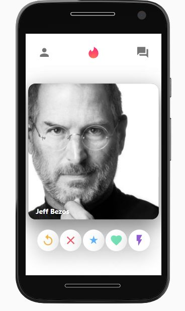

# 🚀 Javascript Front-End 🚀

  

___
___

<table style="width:100%" align="center" width="100%" >

<tr>
<td>
              

              
</td>
            
<td>
            

              
</td>

</tr>

</table>

## Stack :
* React js
* Firebase Firestore Realtime DB
* Material UI
* React Router
* React Context API
* BEM naming convention
_____________________________

### Features :
* Swipe left and right
* Sending/View new message in realtime and store everything inside a firestore database
_____________________________

### Quick Started :
* Go to Firebase Settings > General > Your apps > Firebase SDK snippet > Config and use the information for create your file firebase.js (firebase.js need to be inside src folder)
* Go to Firebase > firestore > create a database

Start the app : `npm start`
_____________________________

### Why this project :
I'm learning web development because that interest me. Now the purpose of this project, that's to practice hmtl, css, javascript, BEM naming convention and react so front-end developement. Some part of this project are hard coded because that's not interesting to do it twice. I already implement a private chat inside a social media and document the solution already for back-end and front-end too if you are interested you can take a look here : https://github.com/Xavier-Pierre-dev/MERN-Social-Media-project. 

### What i learn and practice from this project :
  - BEM naming convention and i find this convention really great for when we want to make a new style of a component, we can easily see which modifiers and children already exist. Finally this convention make the process for writting css/html more clean and easier to understand. 
  - Quick set up a firebase database for work on the front end and also have some advantage in front of mongoose alone like realtime database and that's a requirement for doing chat or private message. 
  - Practicing React/javascript/hmtl/css 

  

